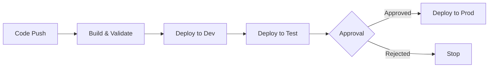
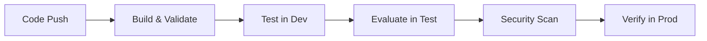

# Documentation Index

Welcome to the Microsoft Agent Framework with Foundry CI/CD documentation. This comprehensive guide covers all aspects of creating, deploying, testing, and securing AI agents using Azure AI Foundry.

## 📚 Table of Contents

### Core Components Documentation
1. [**createagent.py**](./createagent.md) - Agent Creation and Deployment
2. [**exagent.py**](./exagent.md) - Using Existing Agents
3. [**agenteval.py**](./agenteval.md) - Agent Evaluation and Metrics
4. [**redteam.py**](./redteam.md) - Security Testing and Red Teaming

### Deployment Documentation
5. [**Deployment Guide**](./deployment.md) - Complete deployment instructions for both Azure DevOps and GitHub Actions
6. [**Azure DevOps Pipelines**](../cicd/README.md) - Detailed Azure DevOps pipeline setup
7. [**GitHub Actions Workflows**](../.github/workflows/README.md) - GitHub Actions workflow configuration

### Architecture and Diagrams
8. [**Architecture Overview**](./architecture.md) - System architecture, sequence diagrams, and flow charts

## 🚀 Quick Navigation

### For Developers
- **New to the project?** Start with [Architecture Overview](./architecture.md)
- **Creating agents?** See [createagent.py documentation](./createagent.md)
- **Using existing agents?** Check [exagent.py documentation](./exagent.md)
- **Testing agents?** Review [agenteval.py](./agenteval.md) and [redteam.py](./redteam.md)

### For DevOps Engineers
- **Setting up pipelines?** See [Deployment Guide](./deployment.md)
- **Using Azure DevOps?** Check [Azure DevOps Pipelines](../cicd/README.md)
- **Using GitHub Actions?** Review [GitHub Actions Workflows](../.github/workflows/README.md)

## 📖 Documentation Overview

### Agent Creation (`createagent.py`)
Learn how to create and deploy AI agents to Azure AI Foundry with observability and tracing.

**Key Topics:**
- Azure authentication setup
- Agent configuration
- Observability integration
- Async operations

### Agent Consumption (`exagent.py`)
Understand how to interact with existing agents, handle MCP approval requests, and process responses.

**Key Topics:**
- Retrieving existing agents
- Sending queries
- MCP approval handling
- Citation management

### Agent Evaluation (`agenteval.py`)
Explore comprehensive evaluation metrics to measure agent performance.

**Key Topics:**
- Tool call accuracy
- Intent resolution
- Task adherence
- Response completeness

### Security Testing (`redteam.py`)
Discover how to perform security testing with various attack strategies.

**Key Topics:**
- Risk categories
- Attack strategies
- Security reporting
- Callback implementation

## 🏗️ Architecture Diagrams

The [Architecture Overview](./architecture.md) includes:

1. **System Architecture Diagram** - High-level component overview
2. **Agent Creation Sequence Diagram** - Step-by-step agent creation flow
3. **Agent Consumption Sequence Diagram** - Agent usage and interaction flow
4. **Deployment Flow Diagram** - CI/CD deployment process
5. **Agent Reusability Diagram** - How agents are shared and reused

## 🔧 Deployment Workflows

### Agent Creation Deployment


### Agent Testing & Evaluation


## 🎯 Common Use Cases

### 1. Initial Agent Setup
1. Configure Azure resources
2. Set up environment variables
3. Run `createagent.py` to create agent
4. Verify deployment with `exagent.py`

### 2. Continuous Integration
1. Configure CI/CD pipeline (Azure DevOps or GitHub Actions)
2. Commit changes to trigger pipeline
3. Monitor deployment across environments
4. Review evaluation and security results

### 3. Agent Evaluation
1. Deploy agent to test environment
2. Run `agenteval.py` for performance metrics
3. Run `redteam.py` for security testing
4. Review results and make improvements

### 4. Production Deployment
1. Test in dev and test environments
2. Request production approval
3. Deploy to production
4. Monitor agent performance

## 📋 Prerequisites

Before using this framework, ensure you have:

- **Azure subscription** with access to:
  - Azure AI Foundry
  - Azure OpenAI Service
  - Azure Monitor (for observability)
- **Python 3.11+** installed locally
- **Azure CLI** configured
- **Service principal** or **managed identity** for authentication
- **CI/CD platform** (Azure DevOps or GitHub Actions)

## 🔑 Environment Variables

All scripts require specific environment variables. See individual documentation for details:

### Common Variables
```bash
AZURE_AI_PROJECT=https://your-project.api.azureml.ms
AZURE_SUBSCRIPTION_ID=your-subscription-id
AZURE_TENANT_ID=your-tenant-id
AZURE_CLIENT_ID=your-client-id
```

### For Evaluation and Red Team Testing
```bash
AZURE_OPENAI_ENDPOINT=https://your-openai.openai.azure.com/
AZURE_OPENAI_KEY=your-api-key
AZURE_OPENAI_API_VERSION=2024-02-15-preview
AZURE_OPENAI_DEPLOYMENT=gpt-4o
```

## 🛠️ Development Workflow

### Local Development
1. Clone repository
2. Install dependencies: `pip install -r requirements.txt`
3. Set environment variables
4. Test locally with `createagent.py`
5. Verify with `exagent.py`

### CI/CD Deployment
1. Configure pipeline variables/secrets
2. Set up environments (dev, test, prod)
3. Configure approval gates
4. Push to trigger deployment
5. Monitor pipeline execution

## 📊 Monitoring and Observability

All scripts include OpenTelemetry integration for distributed tracing:

- **Trace IDs** are logged for each operation
- **Spans** track execution flow
- **Metrics** monitor performance
- **Logs** provide detailed debugging information

## 🔒 Security Best Practices

1. **Secrets Management**
   - Store credentials in Azure Key Vault
   - Use managed identities when possible
   - Rotate secrets regularly

2. **Access Control**
   - Use role-based access control (RBAC)
   - Implement approval gates for production
   - Audit access logs regularly

3. **Testing**
   - Run red team testing regularly
   - Monitor evaluation metrics
   - Address security findings promptly

4. **Deployment**
   - Test in non-production environments first
   - Use separate resources per environment
   - Implement rollback procedures

## 📞 Support and Resources

### Documentation
- [Azure AI Agent Service](https://learn.microsoft.com/azure/ai-services/agents/)
- [Azure AI Evaluation](https://learn.microsoft.com/azure/ai-studio/how-to/evaluate-sdk)
- [OpenTelemetry Python](https://opentelemetry.io/docs/instrumentation/python/)

### Tools
- [Azure Portal](https://portal.azure.com)
- [Azure AI Foundry](https://ai.azure.com)
- [Azure DevOps](https://dev.azure.com)
- [GitHub Actions](https://github.com/features/actions)

## 🤝 Contributing

When contributing to this project:

1. Follow existing code patterns
2. Update documentation for changes
3. Test in all environments
4. Include observability traces
5. Update diagrams as needed

## 📝 Version History

- **v1.0** (December 2025)
  - Initial documentation
  - Support for Azure DevOps and GitHub Actions
  - Comprehensive diagrams and examples
  - Security testing integration

---

**Last Updated**: December 2025  
**Maintained by**: DevOps & AI Teams  
**License**: See repository LICENSE file
