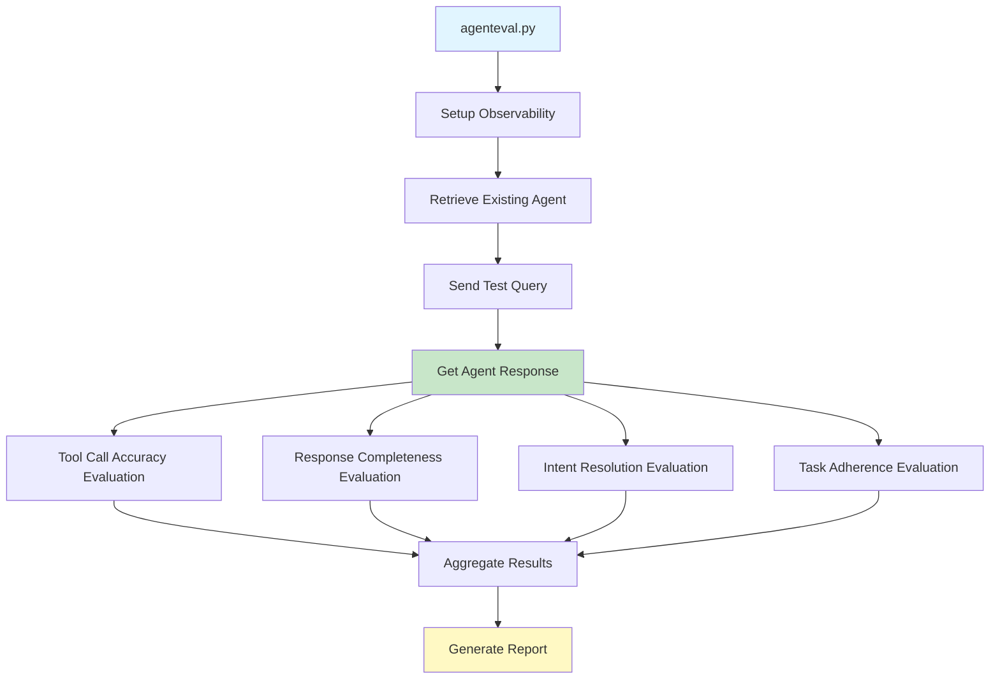

# agenteval.py - Agent Evaluation Documentation

## 📋 Overview

`agenteval.py` demonstrates comprehensive agent evaluation using Azure AI Evaluation SDK. It measures agent performance across multiple dimensions including tool call accuracy, intent resolution, task adherence, and response completeness.

## 🎯 Purpose

- **Evaluate** agent performance with quantitative metrics
- **Measure** tool call accuracy and correctness
- **Assess** intent resolution capabilities
- **Verify** task adherence and instruction following
- **Analyze** response completeness and quality
- **Monitor** agent behavior over time

## 🏗️ Architecture



## 📦 Dependencies

```python
from azure.ai.projects.aio import AIProjectClient
from azure.identity.aio import DefaultAzureCredential
from azure.ai.evaluation import (
    ToolCallAccuracyEvaluator,
    IntentResolutionEvaluator,
    TaskAdherenceEvaluator,
    ResponseCompletenessEvaluator,
    AzureOpenAIModelConfiguration
)
from agent_framework.observability import get_tracer, setup_observability
from opentelemetry.trace import SpanKind
from opentelemetry.trace.span import format_trace_id
from dotenv import load_dotenv
import asyncio
import os
from pprint import pprint
```

### Key Libraries

| Library | Purpose |
|---------|---------|
| `azure.ai.evaluation` | Evaluation metrics and evaluators |
| `azure.ai.projects.aio` | Async Azure AI Project client |
| `azure.identity.aio` | Async Azure authentication |
| `agent_framework.observability` | Distributed tracing |

## 🔧 Configuration

### Environment Variables

```bash
# Azure AI Project (required)
AZURE_AI_PROJECT_ENDPOINT=https://your-project.api.azureml.ms

# Azure OpenAI for Evaluators (required)
AZURE_OPENAI_ENDPOINT=https://your-openai.openai.azure.com/
AZURE_OPENAI_KEY=your-api-key
AZURE_OPENAI_API_VERSION=2024-02-15-preview
AZURE_OPENAI_DEPLOYMENT=gpt-4o

# Azure Authentication
AZURE_SUBSCRIPTION_ID=your-subscription-id
AZURE_TENANT_ID=your-tenant-id
AZURE_CLIENT_ID=your-client-id
```

### Model Configuration

```python
model_config = AzureOpenAIModelConfiguration(
    azure_endpoint=os.environ["AZURE_OPENAI_ENDPOINT"],
    api_key=os.environ["AZURE_OPENAI_KEY"],
    api_version=os.environ["AZURE_OPENAI_API_VERSION"],
    azure_deployment=os.environ["AZURE_OPENAI_DEPLOYMENT"],
)
```

**Why separate OpenAI config?**
- Evaluators use LLMs to judge agent responses
- Can use different model than agent
- Allows control over evaluation costs
- Enables evaluation without modifying agent

## 📝 Code Walkthrough

### 1. Agent Retrieval and Query

```python
credential = DefaultAzureCredential()
client = AIProjectClient(
    endpoint=os.environ["AZURE_AI_PROJECT_ENDPOINT"], 
    credential=credential
)

myAgent = "cicdagenttest"
created_agent = await client.agents.get(agent_name=myAgent)
query = "What are the best practices for CI/CD?"
```

**Steps:**
1. Create async AI Project client
2. Retrieve existing agent by name
3. Define test query
4. Prepare for evaluation

### 2. Get Agent Response

```python
openai_client = client.get_openai_client()

response = await openai_client.responses.create(
    input=[{"role": "user", "content": query}],
    extra_body={"agent": {"name": created_agent.name, "type": "agent_reference"}},
)

print("Initial Response Status:", response.status)
print("Response ID:", response.id)
result = str(response)
```

**Key Points:**
- Uses async operations for better performance
- Captures complete response for evaluation
- Converts response to string for evaluators
- Logs response ID for tracking

## 📊 Evaluation Metrics

### 1. Tool Call Accuracy Evaluator

```python
tool_call_accuracy = ToolCallAccuracyEvaluator(model_config=model_config)

tool_call = {
    "type": "tool_call",
    "tool_call_id": "call_CUdbkBfvVBla2YP3p24uhElJ",
    "name": "fetch_weather",
    "arguments": {"location": "Seattle"},
}

tool_definition = {
    "id": "fetch_weather",
    "name": "fetch_weather",
    "description": "Fetches the weather information for the specified location.",
    "parameters": {
        "type": "object",
        "properties": {
            "location": {"type": "string", "description": "The location to fetch weather for."}
        },
    },
}

response = tool_call_accuracy(
    query=query, 
    tool_calls=tool_call, 
    tool_definitions=tool_definition
)
pprint(response)
```

**What it measures:**
- **Correctness**: Did agent call the right tool?
- **Parameters**: Are tool arguments correct?
- **Relevance**: Is tool call relevant to query?
- **Completeness**: Are all necessary tools called?

**Output Format:**
```python
{
    'tool_call_accuracy': 0.85,  # Score 0-1
    'reasoning': 'Tool call is appropriate but could include...',
    'evaluation_per_tool': [
        {
            'tool_name': 'fetch_weather',
            'score': 0.85,
            'correctness': 'correct',
            'parameter_accuracy': 1.0
        }
    ]
}
```

**Use Cases:**
- Validating function calling capabilities
- Testing tool integration
- Monitoring tool usage patterns
- Debugging tool selection issues

### 2. Response Completeness Evaluator

```python
response_completeness_evaluator = ResponseCompletenessEvaluator(model_config=model_config)

result = response_completeness_evaluator(
    response=result,
    ground_truth=result,
)
pprint(result)
```

**What it measures:**
- **Coverage**: Does response address all aspects of query?
- **Detail**: Is response sufficiently detailed?
- **Missing Information**: What's missing?
- **Relevance**: Is all content relevant?

**Parameters:**
- `response`: Agent's actual response
- `ground_truth`: Expected/ideal response (or same for self-evaluation)

**Output Format:**
```python
{
    'completeness_score': 0.90,  # Score 0-1
    'missing_aspects': ['deployment automation', 'monitoring setup'],
    'covered_aspects': ['testing', 'build pipeline', 'version control'],
    'reasoning': 'Response covers most key aspects but lacks...'
}
```

**Best Practices:**
- Use actual ground truth when available
- Compare against documentation
- Track completeness trends over time
- Set threshold for acceptable completeness

### 3. Intent Resolution Evaluator

```python
intent_resolution_evaluator = IntentResolutionEvaluator(model_config)

result = intent_resolution_evaluator(
    query=query,
    response=result,
)
pprint(result)
```

**What it measures:**
- **Understanding**: Did agent understand user intent?
- **Relevance**: Does response address the intent?
- **Satisfaction**: Would user be satisfied?
- **Clarity**: Is response clear and helpful?

**Output Format:**
```python
{
    'intent_resolution_score': 0.95,  # Score 0-1
    'intent_understood': True,
    'intent_addressed': True,
    'user_satisfaction': 'high',
    'reasoning': 'Agent correctly identified intent and provided...'
}
```

**Use Cases:**
- Measuring user experience quality
- Identifying misunderstandings
- Improving prompt engineering
- A/B testing different agent configurations

### 4. Task Adherence Evaluator

```python
task_adherence_evaluator = TaskAdherenceEvaluator(model_config)

result = task_adherence_evaluator(
    query=query,
    response=result,
)
pprint(result)
```

**What it measures:**
- **Instruction Following**: Did agent follow instructions?
- **Boundaries**: Did agent stay within scope?
- **Format**: Is response in requested format?
- **Constraints**: Are constraints respected?

**Output Format:**
```python
{
    'task_adherence_score': 0.88,  # Score 0-1
    'instructions_followed': True,
    'scope_maintained': True,
    'format_correct': True,
    'constraints_violated': [],
    'reasoning': 'Agent followed all instructions except...'
}
```

**Best Practices:**
- Test with explicit instructions
- Include format requirements in queries
- Test boundary conditions
- Monitor for scope creep

## 🚀 Usage Examples

### Basic Usage (Local Development)

```bash
# Install dependencies
pip install -r requirements.txt

# Set ALL required environment variables
export AZURE_AI_PROJECT_ENDPOINT="https://your-project.api.azureml.ms"
export AZURE_OPENAI_ENDPOINT="https://your-openai.openai.azure.com/"
export AZURE_OPENAI_KEY="your-key"
export AZURE_OPENAI_API_VERSION="2024-02-15-preview"
export AZURE_OPENAI_DEPLOYMENT="gpt-4o"

# Run evaluation
python agenteval.py
```

### Expected Output

```
=== Azure AI Chat Client with Existing Agent ===
Trace ID: 1234567890abcdef1234567890abcdef
Initial Response Status: completed
Response ID: resp_abc123

================================================================================

Tool Call Accuracy Results:
{
    'tool_call_accuracy': 0.85,
    'reasoning': 'Tool selection is appropriate for the weather query...',
    'evaluation_per_tool': [...]
}

Response Completeness Results:
{
    'completeness_score': 0.90,
    'missing_aspects': [],
    'covered_aspects': ['CI/CD definition', 'best practices', 'examples'],
    'reasoning': 'Response comprehensively covers...'
}

Intent Resolution Results:
{
    'intent_resolution_score': 0.95,
    'intent_understood': True,
    'reasoning': 'Agent correctly identified...'
}

Task Adherence Results:
{
    'task_adherence_score': 0.88,
    'instructions_followed': True,
    'reasoning': 'Agent adhered to task requirements...'
}
```

### CI/CD Usage (Azure DevOps)

```yaml
- task: AzureCLI@2
  displayName: 'Run Agent Evaluation'
  inputs:
    azureSubscription: '$(AZURE_SERVICE_CONNECTION_TEST)'
    scriptType: 'bash'
    scriptLocation: 'inlineScript'
    inlineScript: |
      export AZURE_AI_PROJECT_ENDPOINT="$(AZURE_AI_PROJECT_ENDPOINT_TEST)"
      export AZURE_OPENAI_ENDPOINT="$(AZURE_OPENAI_ENDPOINT_TEST)"
      export AZURE_OPENAI_KEY="$(AZURE_OPENAI_KEY_TEST)"
      export AZURE_OPENAI_API_VERSION="$(AZURE_OPENAI_API_VERSION_TEST)"
      export AZURE_OPENAI_DEPLOYMENT="$(AZURE_OPENAI_DEPLOYMENT_TEST)"
      python agenteval.py
```

### Batch Evaluation

```python
async def evaluate_multiple_queries():
    queries = [
        "What is CI/CD?",
        "How do I set up GitHub Actions?",
        "Best practices for Python testing",
    ]
    
    results = []
    for query in queries:
        # Get agent response
        response = await openai_client.responses.create(...)
        
        # Evaluate
        intent_result = intent_resolution_evaluator(
            query=query,
            response=str(response)
        )
        results.append({
            'query': query,
            'intent_score': intent_result['intent_resolution_score']
        })
    
    return results
```

## 🔍 Troubleshooting

### Common Issues and Solutions

#### 1. Missing OpenAI Configuration

**Error:** `KeyError: 'AZURE_OPENAI_ENDPOINT'`

**Solution:**
```bash
# Ensure ALL OpenAI variables are set
export AZURE_OPENAI_ENDPOINT="https://your-openai.openai.azure.com/"
export AZURE_OPENAI_KEY="your-key"
export AZURE_OPENAI_API_VERSION="2024-02-15-preview"
export AZURE_OPENAI_DEPLOYMENT="gpt-4o"
```

#### 2. Evaluation Timeout

**Error:** Evaluation takes too long or times out

**Solutions:**
- Use faster/smaller model for evaluation
- Reduce number of evaluations
- Increase timeout settings
- Check API rate limits

#### 3. Low Scores

**Issue:** Unexpectedly low evaluation scores

**Solutions:**
```python
# Add verbose output to understand reasoning
result = evaluator(query=query, response=response)
print("Reasoning:", result.get('reasoning'))
print("Details:", result)

# Compare with ground truth
# Refine agent instructions
# Check if query is appropriate
```

#### 4. Async Runtime Errors

**Error:** `RuntimeError: Event loop is closed`

**Solution:**
```python
# Ensure proper async execution
if __name__ == "__main__":
    asyncio.run(main())

# Don't mix async and sync code
# Use await for all async operations
```

## 🎨 Customization

### Custom Evaluation Query

```python
# Customize for your domain
query = "Explain the deployment process for microservices"

# Or load from test cases
with open('test_queries.json') as f:
    test_cases = json.load(f)
    for case in test_cases:
        query = case['query']
        expected = case['expected_response']
        # Evaluate...
```

### Custom Ground Truth

```python
# Provide ideal response for comparison
ground_truth = """
CI/CD best practices include:
1. Automated testing at every stage
2. Continuous integration on every commit
3. Automated deployment to staging
4. Manual approval for production
5. Monitoring and rollback capabilities
"""

result = response_completeness_evaluator(
    response=agent_response,
    ground_truth=ground_truth,
)
```

### Weighted Scoring

```python
# Combine multiple metrics with weights
def calculate_overall_score(evaluations):
    weights = {
        'tool_call_accuracy': 0.25,
        'response_completeness': 0.30,
        'intent_resolution': 0.25,
        'task_adherence': 0.20,
    }
    
    total = sum(
        evaluations[key] * weight 
        for key, weight in weights.items()
    )
    return total

overall_score = calculate_overall_score({
    'tool_call_accuracy': 0.85,
    'response_completeness': 0.90,
    'intent_resolution': 0.95,
    'task_adherence': 0.88,
})
print(f"Overall Score: {overall_score:.2f}")
```

### Save Results to File

```python
import json
from datetime import datetime

# Collect all evaluation results
evaluation_results = {
    'timestamp': datetime.now().isoformat(),
    'agent': myAgent,
    'query': query,
    'tool_call_accuracy': tool_accuracy_result,
    'response_completeness': completeness_result,
    'intent_resolution': intent_result,
    'task_adherence': adherence_result,
}

# Save to JSON
with open(f'evaluation_{datetime.now().strftime("%Y%m%d_%H%M%S")}.json', 'w') as f:
    json.dump(evaluation_results, f, indent=2)
```

## 📊 Monitoring and Trending

### Track Metrics Over Time

```python
import pandas as pd
import matplotlib.pyplot as plt

# Collect evaluation data over time
evaluations = []
for day in date_range:
    result = run_evaluation()
    evaluations.append({
        'date': day,
        'intent_score': result['intent_resolution_score'],
        'completeness_score': result['completeness_score'],
    })

# Create DataFrame
df = pd.DataFrame(evaluations)

# Plot trends
df.plot(x='date', y=['intent_score', 'completeness_score'])
plt.title('Agent Performance Trends')
plt.ylabel('Score')
plt.savefig('performance_trends.png')
```

### Set Thresholds and Alerts

```python
THRESHOLDS = {
    'tool_call_accuracy': 0.80,
    'response_completeness': 0.85,
    'intent_resolution': 0.90,
    'task_adherence': 0.85,
}

def check_thresholds(results):
    failures = []
    for metric, threshold in THRESHOLDS.items():
        if results.get(metric, 0) < threshold:
            failures.append(f"{metric}: {results[metric]:.2f} < {threshold:.2f}")
    
    if failures:
        # Send alert
        send_alert(f"Evaluation failures: {', '.join(failures)}")
        return False
    return True
```

## 🔐 Security Considerations

### Secure API Keys

```python
# Use Azure Key Vault for production
from azure.keyvault.secrets import SecretClient
from azure.identity import DefaultAzureCredential

credential = DefaultAzureCredential()
client = SecretClient(vault_url="https://your-vault.vault.azure.net/", credential=credential)

openai_key = client.get_secret("azure-openai-key").value

model_config = AzureOpenAIModelConfiguration(
    azure_endpoint=os.environ["AZURE_OPENAI_ENDPOINT"],
    api_key=openai_key,  # From Key Vault
    # ...
)
```

### Evaluation Data Privacy

```python
# Sanitize queries before logging
def sanitize_for_logging(text):
    # Remove PII, secrets, etc.
    import re
    text = re.sub(r'\b[\w\.-]+@[\w\.-]+\.\w+\b', '[EMAIL]', text)
    text = re.sub(r'\b\d{3}-\d{2}-\d{4}\b', '[SSN]', text)
    return text

logged_query = sanitize_for_logging(query)
```

## 📈 Best Practices

### 1. Regular Evaluation Schedule

```python
# Run evaluations on schedule
# - After each deployment
# - Daily for production agents
# - On demand for development

# Example: CI/CD integration
if os.getenv('CI') == 'true':
    results = run_evaluation()
    if not meets_quality_thresholds(results):
        sys.exit(1)  # Fail the build
```

### 2. Comprehensive Test Suite

```python
# Create diverse test cases
test_suite = [
    {
        'category': 'basic',
        'query': 'What is CI/CD?',
        'min_completeness': 0.80
    },
    {
        'category': 'advanced',
        'query': 'Design a multi-region deployment strategy',
        'min_completeness': 0.85
    },
    {
        'category': 'edge_case',
        'query': 'Handle deployment rollback with database migrations',
        'min_completeness': 0.75
    },
]
```

### 3. Baseline Comparisons

```python
# Compare against baseline
baseline_scores = load_baseline_scores()
current_scores = run_evaluation()

for metric in baseline_scores:
    delta = current_scores[metric] - baseline_scores[metric]
    if delta < -0.05:  # 5% degradation
        print(f"WARNING: {metric} degraded by {delta:.2%}")
```

## 🔗 Related Documentation

- [createagent.py](./createagent.md) - Creating agents
- [exagent.py](./exagent.md) - Using agents
- [redteam.py](./redteam.md) - Security testing
- [Deployment Guide](./deployment.md) - CI/CD deployment
- [Architecture](./architecture.md) - System architecture

## 📚 Additional Resources

- [Azure AI Evaluation Documentation](https://learn.microsoft.com/azure/ai-studio/how-to/evaluate-sdk)
- [Prompt Flow Evaluation](https://learn.microsoft.com/azure/machine-learning/prompt-flow/how-to-develop-an-evaluation-flow)
- [LLM Evaluation Metrics](https://learn.microsoft.com/azure/ai-studio/concepts/evaluation-metrics-built-in)

---

**Last Updated**: December 2025  
**Version**: 1.0  
**Maintained by**: DevOps & AI Teams
