# Architecture Overview

## 📋 System Architecture

This document provides a comprehensive overview of the Microsoft Agent Framework with Foundry CI/CD architecture, including system components, deployment flows, and agent reusability patterns.

## 🏗️ High-Level System Architecture

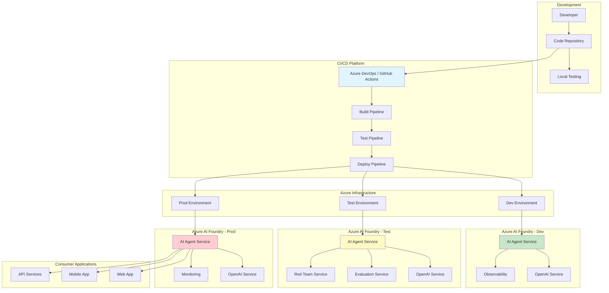

## 🔄 Agent Creation Deployment Flow

This diagram shows the complete flow for creating and deploying a new AI agent across environments.

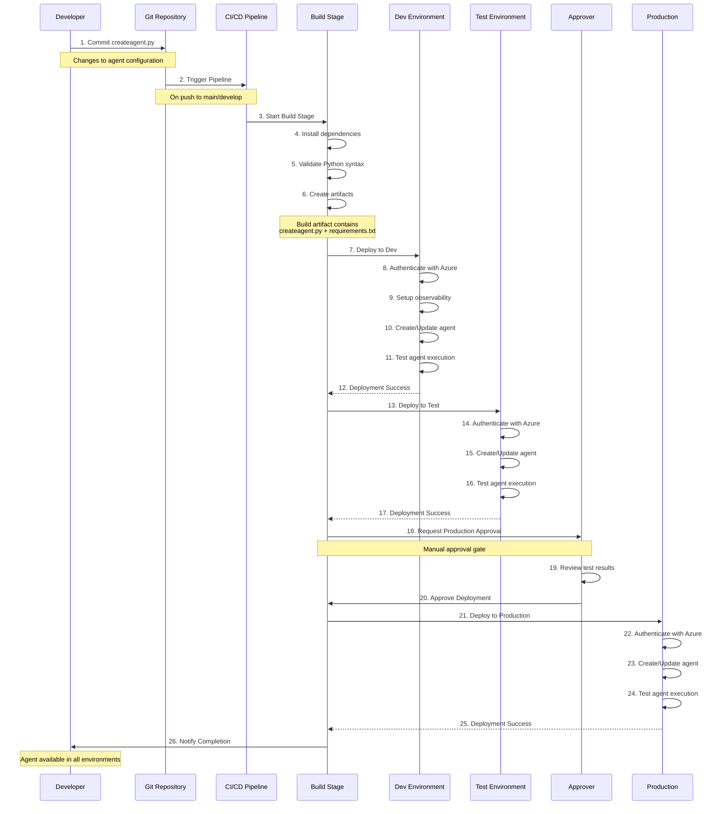

## 🧪 Agent Consumption and Testing Flow

This diagram illustrates how existing agents are tested, evaluated, and security-scanned.

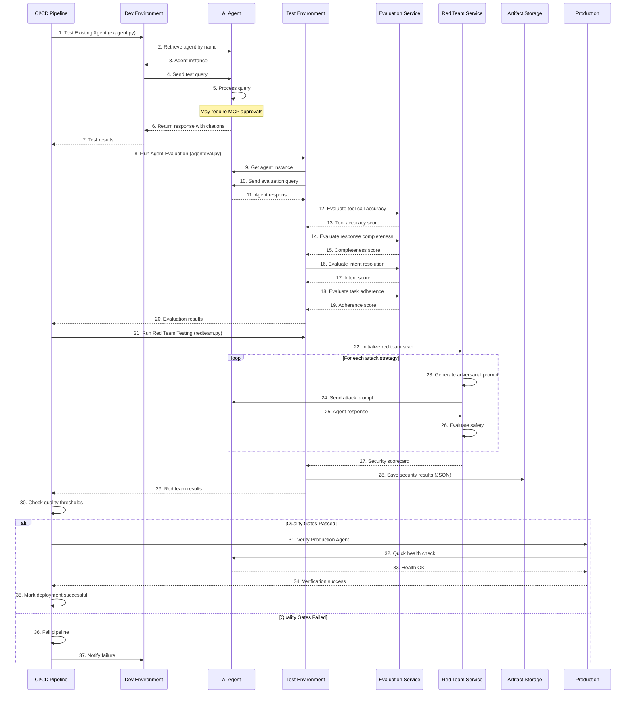

## 🔁 Agent Reusability Pattern

This diagram shows how agents created in one deployment can be consumed by multiple applications.

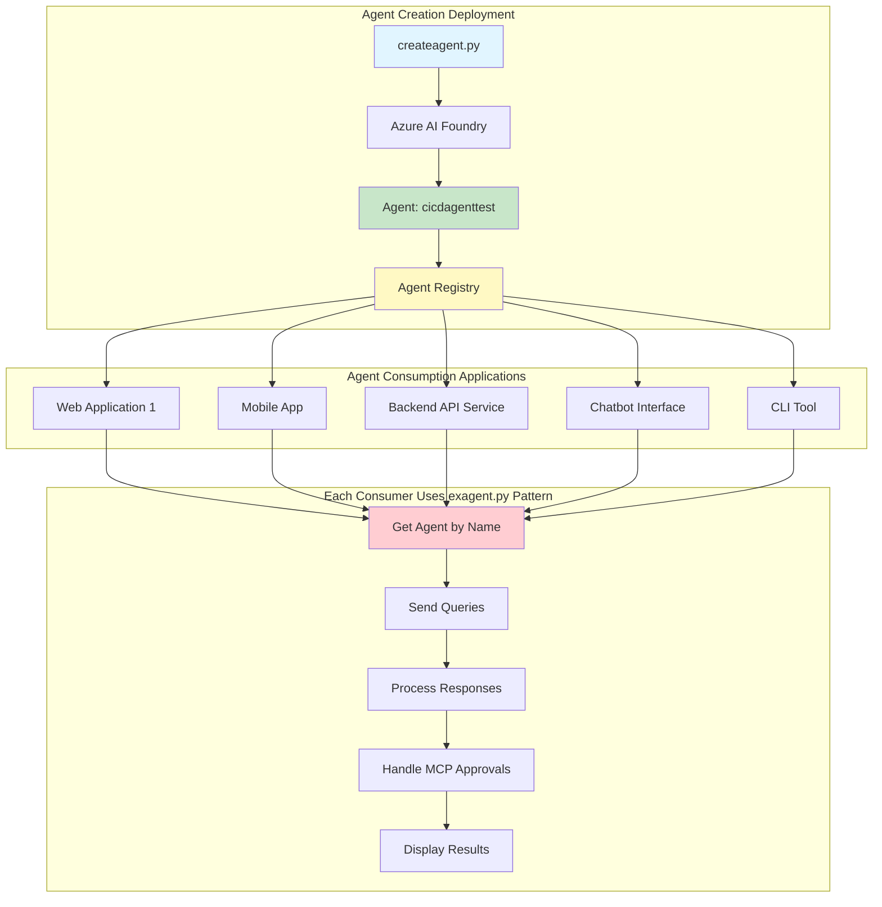

### Agent Reusability Benefits

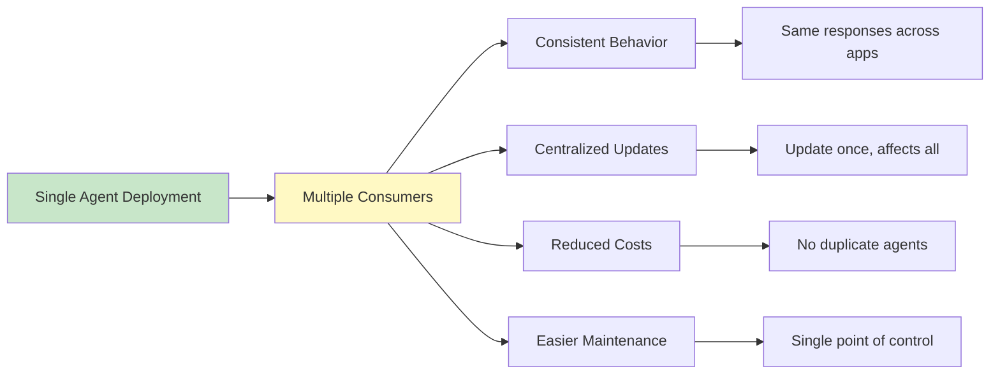

## 📊 Deployment Flow Diagram

### Create Agent Deployment Process

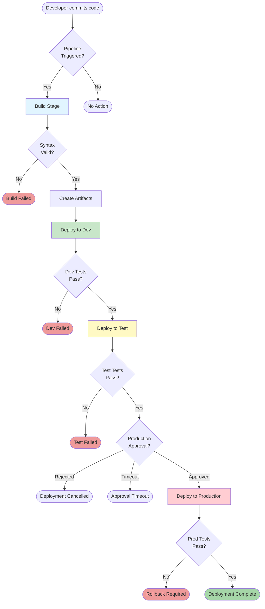

### Agent Testing and Evaluation Process

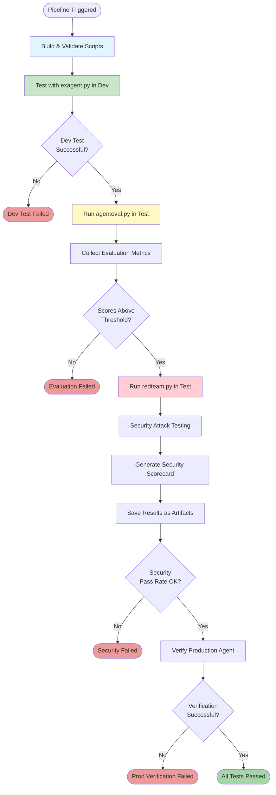

## 🎯 Component Architecture

### Core Components

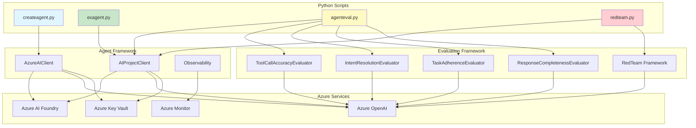

## 🔐 Security Architecture

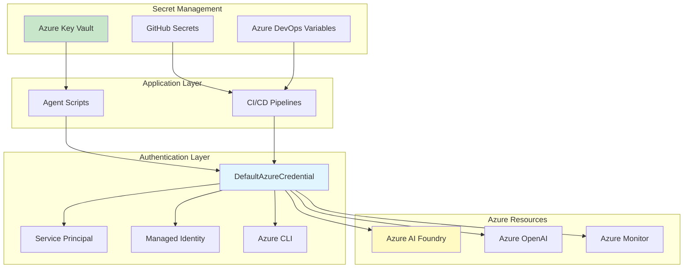

## 📈 Data Flow Architecture

### Agent Creation Data Flow

```mermaid
flowchart LR
    A[Environment Variables] --> B[createagent.py]
    B --> C[Azure Authentication]
    C --> D[AzureAIClient]
    D --> E[Create Agent Request]
    E --> F[Azure AI Foundry API]
    F --> G[Agent Instance]
    G --> H[Execute Test Query]
    H --> I[Agent Response]
    I --> J[OpenTelemetry Trace]
    J --> K[Azure Monitor]
    
    style B fill:#e1f5ff
    style G fill:#c8e6c9
    style K fill:#fff9c4
```

### Agent Consumption Data Flow

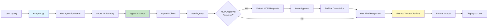

## 🌐 Multi-Environment Architecture

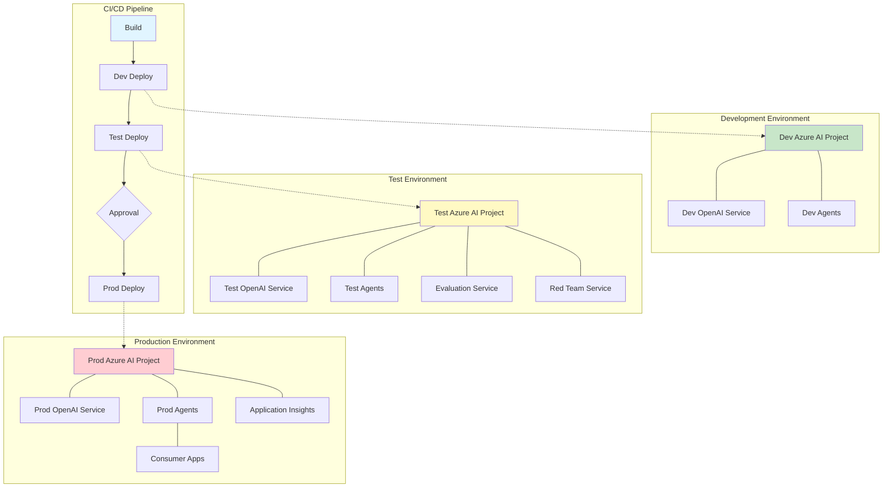

## 🔄 Agent Lifecycle

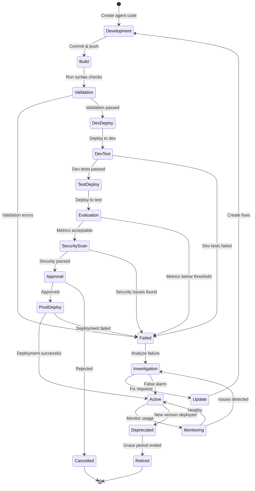

## 📊 Observability Architecture

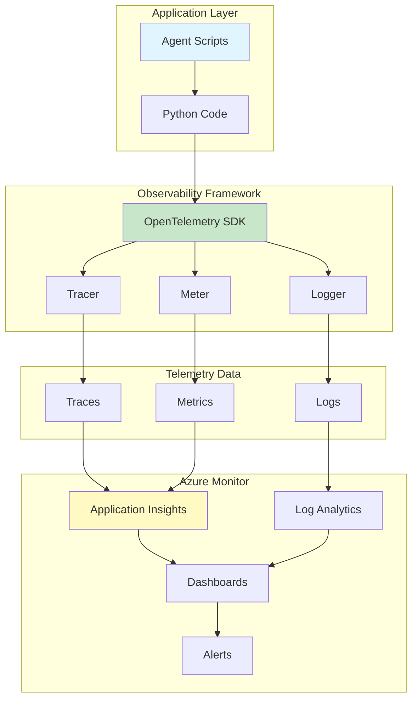

## 🎯 Key Architectural Principles

### 1. Separation of Concerns

- **Agent Creation**: Isolated in `createagent.py`
- **Agent Consumption**: Handled by `exagent.py`
- **Evaluation**: Dedicated `agenteval.py`
- **Security Testing**: Separate `redteam.py`

### 2. Environment Isolation

- Independent Azure resources per environment
- Separate credentials and configurations
- No cross-environment dependencies
- Progressive deployment: Dev → Test → Prod

### 3. Reusability

- Agents created once, consumed many times
- Consistent agent behavior across applications
- Centralized updates and maintenance
- Shared evaluation and security testing

### 4. Security by Design

- Multiple authentication methods
- Secrets stored in Key Vault
- Role-based access control (RBAC)
- Approval gates for production
- Regular security scanning

### 5. Observability First

- Distributed tracing with OpenTelemetry
- Trace IDs for request correlation
- Metrics collection and monitoring
- Centralized logging in Azure Monitor

### 6. CI/CD Integration

- Automated build and validation
- Multi-environment deployment
- Quality gates and thresholds
- Automated testing and security scans

## 📚 Architecture Decision Records (ADRs)

### ADR-001: Use DefaultAzureCredential for Authentication

**Status**: Accepted

**Context**: Need flexible authentication for local dev and CI/CD

**Decision**: Use `DefaultAzureCredential` which tries multiple methods

**Consequences**: 
- ✅ Works in multiple environments without code changes
- ✅ Supports service principal, managed identity, Azure CLI
- ⚠️ Requires understanding of credential chain order

### ADR-002: Separate Agent Creation and Consumption

**Status**: Accepted

**Context**: Need clear separation between deployment and usage

**Decision**: Create separate scripts for creation (`createagent.py`) and consumption (`exagent.py`)

**Consequences**:
- ✅ Clear responsibilities
- ✅ Enables agent reusability
- ✅ Different deployment patterns
- ⚠️ Requires understanding of both patterns

### ADR-003: Multi-Environment Deployment with Approval Gates

**Status**: Accepted

**Context**: Need safe path to production with validation

**Decision**: Deploy through Dev → Test → Prod with approvals

**Consequences**:
- ✅ Gradual rollout reduces risk
- ✅ Testing in non-prod before prod
- ✅ Manual approval for production
- ⚠️ Longer deployment time

### ADR-004: Include Security Testing in Pipeline

**Status**: Accepted

**Context**: Need to ensure agents are safe before production

**Decision**: Integrate red team testing in test environment

**Consequences**:
- ✅ Automated security validation
- ✅ Identifies vulnerabilities early
- ✅ Security reports as artifacts
- ⚠️ Increases pipeline execution time

## 🔗 Related Documentation

- [createagent.py](./createagent.md) - Agent creation details
- [exagent.py](./exagent.md) - Agent consumption details
- [agenteval.py](./agenteval.md) - Evaluation metrics
- [redteam.py](./redteam.md) - Security testing
- [Deployment Guide](./deployment.md) - Deployment procedures
- [Main Documentation](./README.md) - Documentation index

---

**Last Updated**: December 2025  
**Version**: 1.0  
**Maintained by**: Architecture & DevOps Teams
