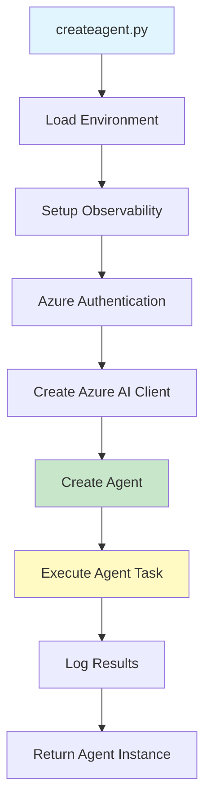

# createagent.py - Agent Creation Documentation

## 📋 Overview

`createagent.py` is the foundational script for creating and deploying AI agents to Azure AI Foundry. It demonstrates how to create a new agent with custom instructions, configure observability, and execute initial agent tasks.

## 🎯 Purpose

- **Create** new AI agents in Azure AI Foundry
- **Configure** agent instructions and behavior
- **Enable** distributed tracing and observability
- **Execute** initial agent tasks for validation
- **Deploy** agents to specific environments (dev, test, prod)

## 🏗️ Architecture



## 📦 Dependencies

```python
from azure.identity import DefaultAzureCredential
from agent_framework.azure import AzureAIClient
from agent_framework.observability import get_tracer, setup_observability
from opentelemetry.trace import SpanKind
from opentelemetry.trace.span import format_trace_id
from dotenv import load_dotenv
import os
import asyncio
```

### Key Libraries

| Library | Purpose |
|---------|---------|
| `azure.identity` | Azure authentication using DefaultAzureCredential |
| `agent_framework.azure` | Azure AI client for agent management |
| `agent_framework.observability` | OpenTelemetry tracing and monitoring |
| `dotenv` | Environment variable management |
| `asyncio` | Asynchronous execution support |

## 🔧 Configuration

### Environment Variables

The script requires the following environment variables:

```bash
# Azure AI Project Endpoint (required)
AZURE_AI_PROJECT=https://your-project.api.azureml.ms

# Azure Authentication (for service principal)
AZURE_SUBSCRIPTION_ID=your-subscription-id
AZURE_TENANT_ID=your-tenant-id
AZURE_CLIENT_ID=your-client-id
```

### Setting Up Environment Variables

#### Option 1: Using .env File (Local Development)
Create a `.env` file in the project root:

```bash
AZURE_AI_PROJECT=https://your-project.api.azureml.ms
AZURE_SUBSCRIPTION_ID=xxxxxxxx-xxxx-xxxx-xxxx-xxxxxxxxxxxx
AZURE_TENANT_ID=xxxxxxxx-xxxx-xxxx-xxxx-xxxxxxxxxxxx
AZURE_CLIENT_ID=xxxxxxxx-xxxx-xxxx-xxxx-xxxxxxxxxxxx
```

#### Option 2: System Environment Variables
```bash
export AZURE_AI_PROJECT="https://your-project.api.azureml.ms"
export AZURE_SUBSCRIPTION_ID="your-subscription-id"
export AZURE_TENANT_ID="your-tenant-id"
export AZURE_CLIENT_ID="your-client-id"
```

#### Option 3: CI/CD Pipeline Variables
See [Deployment Documentation](./deployment.md) for pipeline-specific configuration.

## 📝 Code Walkthrough

### 1. Environment Setup

```python
# Load environment variables from .env file
load_dotenv()

# Get Azure AI Project endpoint
myEndpoint = os.getenv("AZURE_AI_PROJECT")
```

**What it does:**
- Loads environment variables from `.env` file if present
- Retrieves the Azure AI Project endpoint URL
- Falls back to system environment variables if `.env` doesn't exist

### 2. Main Agent Creation Function

```python
async def createagent():
    # Setup observability first
    setup_observability()
    
    # Create Azure credential
    credential = DefaultAzureCredential()
    
    # Agent name
    myAgent = "cicdagenttest"
```

**Key Points:**
- Function is `async` to support asynchronous operations
- Observability is set up before any operations
- `DefaultAzureCredential()` tries multiple authentication methods in order:
  1. Environment variables (service principal)
  2. Managed Identity (when running in Azure)
  3. Azure CLI (local development)
  4. Visual Studio Code
  5. Azure PowerShell

### 3. Distributed Tracing

```python
with get_tracer().start_as_current_span("cicdagenttest", kind=SpanKind.CLIENT) as current_span:
    print(f"Trace ID: {format_trace_id(current_span.get_span_context().trace_id)}")
```

**What it does:**
- Creates a trace span named "cicdagenttest"
- Marks it as a CLIENT span (making external calls)
- Generates and logs a unique Trace ID for debugging
- All operations within this context are traced

**Trace ID Benefits:**
- Track requests across distributed systems
- Debug issues by searching logs with Trace ID
- Monitor performance and latency
- Correlate logs across multiple services

### 4. Create Azure AI Client

```python
credential = DefaultAzureCredential()
client = AzureAIClient(credential=credential)
```

**What it does:**
- Creates authenticated client for Azure AI services
- Uses credential to access Azure resources
- Automatically handles token refresh
- Provides interface to agent management APIs

### 5. Create the Agent

```python
agent = client.create_agent(
    name=myAgent, 
    instructions="You are CICD Agent, an AI agent designed to assist with continuous integration and continuous deployment tasks."
)
```

**Parameters:**
- `name`: Unique identifier for the agent (e.g., "cicdagenttest")
- `instructions`: System prompt defining agent's role and behavior

**What happens:**
1. Checks if agent with this name already exists
2. If not exists, creates new agent with specified instructions
3. If exists, may update or return existing agent (depends on implementation)
4. Registers agent in Azure AI Foundry
5. Returns agent instance for use

**Agent Instructions Best Practices:**
- Be specific about the agent's role
- Define boundaries and limitations
- Include expected behavior
- Specify expertise areas
- Set tone and style guidelines

### 6. Execute Agent Task

```python
result = await agent.run("Create a CICD pipeline for a Python application using GitHub Actions.")
print(result)
```

**What it does:**
- Sends a test query to the newly created agent
- Waits for agent response (async operation)
- Prints the result to console
- Validates that agent is functioning correctly

**Why test immediately?**
- Confirms agent was created successfully
- Validates agent can process requests
- Provides immediate feedback
- Catches configuration issues early

### 7. Async Execution

```python
if __name__ == "__main__":
    import asyncio
    asyncio.run(createagent())
```

**What it does:**
- Entry point when script is run directly
- Executes the async `createagent()` function
- Manages async event loop
- Ensures proper cleanup

## 🚀 Usage Examples

### Basic Usage (Local Development)

```bash
# Install dependencies
pip install -r requirements.txt

# Set environment variables
export AZURE_AI_PROJECT="https://your-project.api.azureml.ms"

# Run the script
python createagent.py
```

### Expected Output

```
Trace ID: 1234567890abcdef1234567890abcdef
The agent has been created successfully. Here's a sample CICD pipeline for a Python application using GitHub Actions:

[Agent response with pipeline configuration]
```

### CI/CD Usage (Azure DevOps)

```yaml
- task: AzureCLI@2
  displayName: 'Deploy Agent in Dev'
  inputs:
    azureSubscription: '$(AZURE_SERVICE_CONNECTION_DEV)'
    scriptType: 'bash'
    scriptLocation: 'inlineScript'
    inlineScript: |
      export AZURE_AI_PROJECT="$(AZURE_AI_PROJECT_DEV)"
      python createagent.py
```

### CI/CD Usage (GitHub Actions)

```yaml
- name: Create Agent
  run: |
    export AZURE_AI_PROJECT="${{ secrets.AZURE_AI_PROJECT_DEV }}"
    python createagent.py
```

## 🔍 Troubleshooting

### Common Issues and Solutions

#### 1. Authentication Failures

**Error:** `DefaultAzureCredential failed to retrieve a token`

**Solutions:**
```bash
# For local development, login with Azure CLI
az login

# Verify authentication
az account show

# For CI/CD, ensure service principal credentials are set
export AZURE_CLIENT_ID="your-client-id"
export AZURE_CLIENT_SECRET="your-client-secret"
export AZURE_TENANT_ID="your-tenant-id"
```

#### 2. Missing Environment Variables

**Error:** `NoneType object has no attribute 'replace'` or similar

**Solution:**
```bash
# Check if AZURE_AI_PROJECT is set
echo $AZURE_AI_PROJECT

# Set it if missing
export AZURE_AI_PROJECT="https://your-project.api.azureml.ms"
```

#### 3. Agent Already Exists

**Error:** `Agent with name 'cicdagenttest' already exists`

**Solutions:**
- Use a different agent name
- Delete the existing agent if no longer needed
- Update the existing agent instead of creating new one

#### 4. Permission Denied

**Error:** `403 Forbidden` or `Authorization failed`

**Solution:**
```bash
# Verify service principal has required roles:
# - Cognitive Services Contributor
# - Azure AI Developer

# Assign roles using Azure CLI
az role assignment create \
  --assignee {client-id} \
  --role "Cognitive Services Contributor" \
  --scope /subscriptions/{subscription-id}/resourceGroups/{resource-group}

az role assignment create \
  --assignee {client-id} \
  --role "Azure AI Developer" \
  --scope /subscriptions/{subscription-id}/resourceGroups/{resource-group}
```

#### 5. Observability Setup Errors

**Error:** Issues with OpenTelemetry configuration

**Solution:**
- Ensure `agent_framework` package is installed correctly
- Check if observability backend (Azure Monitor) is configured
- Verify network connectivity to telemetry endpoints

## 🎨 Customization

### Changing Agent Name

```python
myAgent = "my-custom-agent-name"
```

**Naming Guidelines:**
- Use lowercase with hyphens
- Be descriptive of agent's purpose
- Keep it under 50 characters
- Avoid special characters except hyphens

### Customizing Agent Instructions

```python
instructions = """You are a specialized AI agent for DevOps automation.

Your capabilities:
- Create and optimize CI/CD pipelines
- Suggest best practices for deployment
- Help troubleshoot build failures
- Recommend security improvements

Your limitations:
- Do not execute destructive operations
- Always confirm before making changes
- Prioritize security and compliance
"""

agent = client.create_agent(
    name=myAgent,
    instructions=instructions
)
```

### Adding Additional Configuration

```python
agent = client.create_agent(
    name=myAgent,
    instructions=instructions,
    model="gpt-4o",  # Specify model if supported
    temperature=0.7,  # Control response randomness
    # Additional parameters as supported by the framework
)
```

### Modifying the Test Query

```python
# Change the test query to match your use case
result = await agent.run("What are the best practices for Python CI/CD?")

# Or skip the test query entirely if not needed
# result = None
```

## 📊 Monitoring and Observability

### Trace IDs

Every agent creation generates a unique Trace ID:

```
Trace ID: 1234567890abcdef1234567890abcdef
```

**Use Trace IDs to:**
- Search logs in Azure Monitor
- Debug issues across services
- Track request flow
- Monitor performance

### Viewing Traces in Azure Monitor

1. Go to Azure Portal
2. Navigate to your Application Insights resource
3. Click on "Transaction search"
4. Search for the Trace ID
5. View detailed request flow

### Adding Custom Spans

```python
from agent_framework.observability import get_tracer

with get_tracer().start_as_current_span("custom-operation") as span:
    span.set_attribute("agent.name", myAgent)
    span.set_attribute("environment", "dev")
    # Your code here
```

## 🔐 Security Considerations

### Credential Management

✅ **DO:**
- Use managed identities in Azure environments
- Store secrets in Azure Key Vault
- Use service principals with least privilege
- Rotate credentials regularly

❌ **DON'T:**
- Hard-code credentials in code
- Commit `.env` files to version control
- Share credentials across environments
- Use overly permissive roles

### Agent Instructions

✅ **DO:**
- Define clear boundaries
- Specify what agent should NOT do
- Include compliance requirements
- Set appropriate tone and behavior

❌ **DON'T:**
- Give unlimited capabilities
- Allow harmful operations
- Include sensitive information
- Ignore security implications

## 📈 Best Practices

### 1. Environment Separation

```python
# Use environment-specific agent names
env = os.getenv("ENVIRONMENT", "dev")
myAgent = f"cicdagent-{env}"
```

### 2. Error Handling

```python
async def createagent():
    try:
        setup_observability()
        credential = DefaultAzureCredential()
        
        # ... rest of code ...
        
    except Exception as e:
        print(f"Error creating agent: {e}")
        # Log to monitoring system
        raise
```

### 3. Idempotent Operations

```python
# Check if agent exists before creating
try:
    agent = client.get_agent(name=myAgent)
    print(f"Agent {myAgent} already exists")
except:
    agent = client.create_agent(name=myAgent, instructions=instructions)
    print(f"Agent {myAgent} created successfully")
```

### 4. Logging

```python
import logging

logging.basicConfig(level=logging.INFO)
logger = logging.getLogger(__name__)

logger.info(f"Creating agent: {myAgent}")
logger.info(f"Trace ID: {trace_id}")
logger.info("Agent created successfully")
```

## 🔗 Related Documentation

- [exagent.py](./exagent.md) - Using existing agents
- [agenteval.py](./agenteval.md) - Evaluating agent performance
- [redteam.py](./redteam.md) - Security testing
- [Deployment Guide](./deployment.md) - CI/CD deployment
- [Architecture](./architecture.md) - System architecture

## 📚 Additional Resources

- [Azure AI Agent Service Documentation](https://learn.microsoft.com/azure/ai-services/agents/)
- [Azure Identity Library](https://learn.microsoft.com/python/api/overview/azure/identity-readme)
- [OpenTelemetry Python](https://opentelemetry.io/docs/instrumentation/python/)
- [Async/Await in Python](https://docs.python.org/3/library/asyncio.html)

---

**Last Updated**: December 2025  
**Version**: 1.0  
**Maintained by**: DevOps & AI Teams
