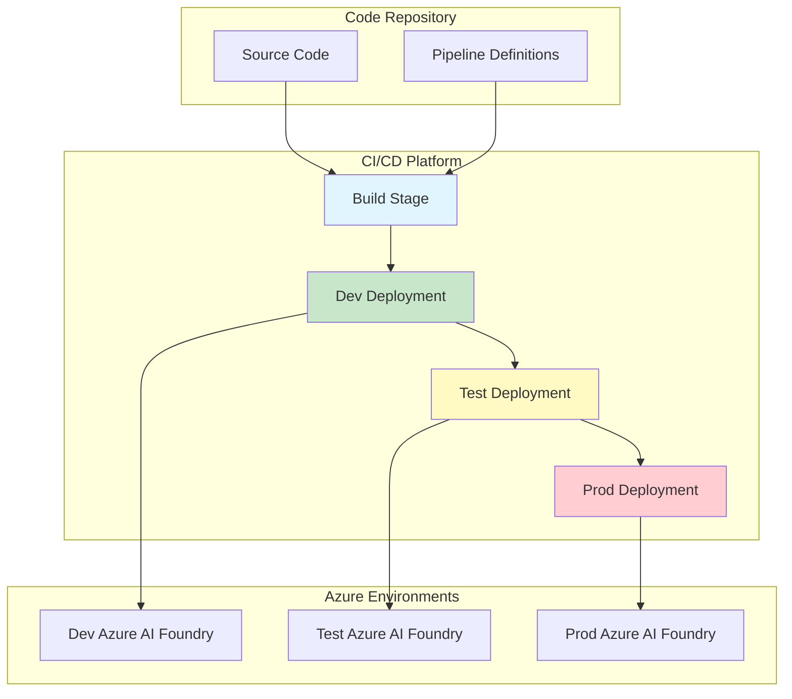
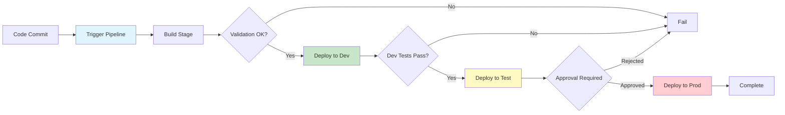
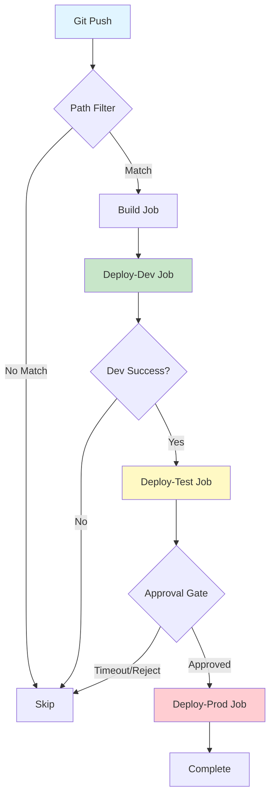
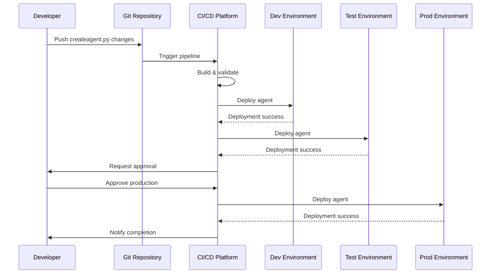
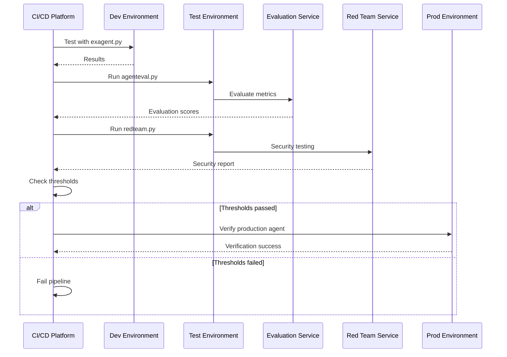

# Deployment Documentation

## 📋 Overview

This guide provides comprehensive deployment instructions for the Microsoft Agent Framework with Foundry CI/CD. It covers both **Azure DevOps Pipelines** and **GitHub Actions** workflows for deploying AI agents across multiple environments (dev, test, production).

## 🎯 Deployment Strategies

The project supports two primary deployment pipelines:

### 1. Agent Creation Pipeline
- **Purpose**: Create and deploy new AI agents
- **Environments**: Dev → Test → Production
- **Approval Gates**: Required for production
- **Scripts Used**: `createagent.py`

### 2. Agent Consumption/Testing Pipeline
- **Purpose**: Test, evaluate, and security-test existing agents
- **Environments**: Dev → Test → Production
- **Scripts Used**: `exagent.py`, `agenteval.py`, `redteam.py`
- **Artifacts**: Evaluation results, security reports

## 🏗️ Deployment Architecture



## 📦 Prerequisites

### Azure Resources (Per Environment)

| Resource | Purpose | Required For |
|----------|---------|--------------|
| Azure AI Project | Agent hosting and management | All scripts |
| Azure OpenAI Service | LLM model deployment | Evaluation, Red Team |
| Azure Monitor | Observability and tracing | Optional |
| Azure Key Vault | Secrets management | Recommended |
| Service Principal | Authentication | CI/CD |

### Software Requirements

```bash
# Local Development
- Python 3.11 or higher
- pip (Python package manager)
- Azure CLI
- Git

# CI/CD Platform
- Azure DevOps organization OR
- GitHub account with Actions enabled
```

## 🚀 Quick Start

### Option 1: Azure DevOps

1. **Clone repository**
   ```bash
   git clone https://github.com/balakreshnan/foundrycicdbasic.git
   cd foundrycicdbasic
   ```

2. **Follow Azure DevOps setup**
   - See [Azure DevOps Detailed Guide](#azure-devops-pipelines) below
   - Configure service connections
   - Create variable groups
   - Set up environments

3. **Create pipeline**
   - Use existing YAML: `cicd/createagentpipeline.yml`
   - Or: `cicd/agentconsumptionpipeline.yml`

### Option 2: GitHub Actions

1. **Fork or clone repository**
   ```bash
   git clone https://github.com/balakreshnan/foundrycicdbasic.git
   cd foundrycicdbasic
   ```

2. **Follow GitHub Actions setup**
   - See [GitHub Actions Detailed Guide](#github-actions-workflows) below
   - Configure secrets
   - Create environments
   - Grant permissions

3. **Push to trigger workflow**
   ```bash
   git add .
   git commit -m "Initial setup"
   git push origin main
   ```

## 🔧 Azure DevOps Pipelines

### Complete Setup Guide

#### Step 1: Create Service Principals

```bash
# Create service principal for each environment
az ad sp create-for-rbac \
  --name "foundry-cicd-dev" \
  --role contributor \
  --scopes /subscriptions/{subscription-id}/resourceGroups/{dev-rg}

# Save the output for later use
# Repeat for test and prod environments
```

#### Step 2: Assign Azure Roles

```bash
# For each service principal, assign required roles
SP_ID="<service-principal-client-id>"
SUB_ID="<subscription-id>"
RG="<resource-group>"

# Cognitive Services Contributor (for OpenAI)
az role assignment create \
  --assignee $SP_ID \
  --role "Cognitive Services Contributor" \
  --scope "/subscriptions/$SUB_ID/resourceGroups/$RG"

# Azure AI Developer (for AI Foundry)
az role assignment create \
  --assignee $SP_ID \
  --role "Azure AI Developer" \
  --scope "/subscriptions/$SUB_ID/resourceGroups/$RG"
```

#### Step 3: Create Service Connections

1. Navigate to Azure DevOps project
2. Go to **Project Settings** → **Service connections**
3. Click **New service connection** → **Azure Resource Manager**
4. Choose **Service principal (manual)**
5. Fill in details from Step 1:

```yaml
Service connection name: AZURE_SERVICE_CONNECTION_DEV
Subscription ID: <your-subscription-id>
Subscription Name: <your-subscription-name>
Service Principal ID: <client-id from Step 1>
Service Principal Key: <client-secret from Step 1>
Tenant ID: <tenant-id from Step 1>
```

6. ☑ Grant access permission to all pipelines
7. Click **Verify and save**
8. Repeat for TEST and PROD

#### Step 4: Create Variable Groups

Navigate to **Pipelines** → **Library** → **+ Variable group**

**Dev Variables (`agent-dev-vars`):**
```yaml
AZURE_AI_PROJECT_DEV: https://your-dev-project.api.azureml.ms
AZURE_AI_PROJECT_ENDPOINT_DEV: https://your-dev-project.api.azureml.ms
AZURE_OPENAI_ENDPOINT_DEV: https://your-dev-openai.openai.azure.com/
AZURE_OPENAI_KEY_DEV: <your-dev-key>  # 🔒 Make secret
AZURE_OPENAI_API_VERSION_DEV: 2024-02-15-preview
AZURE_OPENAI_DEPLOYMENT_DEV: gpt-4o
AZURE_SERVICE_CONNECTION_DEV: AZURE_SERVICE_CONNECTION_DEV
```

**Test Variables (`agent-test-vars`):**
```yaml
AZURE_AI_PROJECT_TEST: https://your-test-project.api.azureml.ms
AZURE_AI_PROJECT_ENDPOINT_TEST: https://your-test-project.api.azureml.ms
AZURE_OPENAI_ENDPOINT_TEST: https://your-test-openai.openai.azure.com/
AZURE_OPENAI_KEY_TEST: <your-test-key>  # 🔒 Make secret
AZURE_OPENAI_API_VERSION_TEST: 2024-02-15-preview
AZURE_OPENAI_DEPLOYMENT_TEST: gpt-4o
AZURE_SERVICE_CONNECTION_TEST: AZURE_SERVICE_CONNECTION_TEST
```

**Prod Variables (`agent-prod-vars`):**
```yaml
AZURE_AI_PROJECT_PROD: https://your-prod-project.api.azureml.ms
AZURE_AI_PROJECT_ENDPOINT_PROD: https://your-prod-project.api.azureml.ms
AZURE_OPENAI_ENDPOINT_PROD: https://your-prod-openai.openai.azure.com/
AZURE_OPENAI_KEY_PROD: <your-prod-key>  # 🔒 Make secret
AZURE_OPENAI_API_VERSION_PROD: 2024-02-15-preview
AZURE_OPENAI_DEPLOYMENT_PROD: gpt-4o
AZURE_SERVICE_CONNECTION_PROD: AZURE_SERVICE_CONNECTION_PROD
```

**Global Variables (add to pipeline or separate group):**
```yaml
AZURE_SUBSCRIPTION_ID: <subscription-id>
AZURE_TENANT_ID: <tenant-id>
AZURE_CLIENT_ID: <client-id>  # Can be environment-specific
```

#### Step 5: Create Environments

1. Go to **Pipelines** → **Environments**
2. Click **New environment**

**Dev Environment:**
- Name: `dev`
- Description: "Development environment"
- No approval gates (fast iteration)

**Test Environment:**
- Name: `test`
- Description: "Testing environment"
- Optional approvals:
  - Click **Approvals and checks**
  - Add **Approvals**
  - Select reviewers

**Production Environment:**
- Name: `production`
- Description: "Production environment"
- **Required** approvals:
  - Click **Approvals and checks**
  - Add **Approvals**
  - Select required approvers (e.g., tech lead, manager)
  - Set timeout: 7 days
  - Instructions: "Review test results before production deployment"

#### Step 6: Create Pipelines

**For Agent Creation:**
1. Go to **Pipelines** → **Pipelines** → **New pipeline**
2. Select **Azure Repos Git** (or GitHub if code is there)
3. Select repository: `foundrycicdbasic`
4. Select **Existing Azure Pipelines YAML file**
5. Path: `/cicd/createagentpipeline.yml`
6. Click **Continue** → **Save**
7. Rename to: "Agent Creation Pipeline"

**For Agent Testing:**
1. Repeat steps above
2. Path: `/cicd/agentconsumptionpipeline.yml`
3. Rename to: "Agent Testing & Evaluation Pipeline"

#### Step 7: Run Pipeline

1. Select the pipeline
2. Click **Run pipeline**
3. Select branch: `main`
4. Click **Run**
5. Monitor execution in each stage
6. Approve when prompted (test/prod)

### Azure DevOps Pipeline Flow



## 🐙 GitHub Actions Workflows

### Complete Setup Guide

#### Step 1: Create Service Principals (Same as Azure DevOps)

```bash
# For each environment
az ad sp create-for-rbac \
  --name "github-foundry-dev" \
  --role contributor \
  --scopes /subscriptions/{sub-id}/resourceGroups/{dev-rg} \
  --sdk-auth

# Save the entire JSON output - you'll need it for GitHub Secrets
```

#### Step 2: Configure GitHub Secrets

1. Go to repository → **Settings** → **Secrets and variables** → **Actions**
2. Click **New repository secret**

**Global Secrets:**
```yaml
AZURE_SUBSCRIPTION_ID: <subscription-id>
AZURE_TENANT_ID: <tenant-id>
```

**Dev Secrets:**
```yaml
AZURE_CREDENTIALS_DEV: |
  {
    "clientId": "xxx",
    "clientSecret": "xxx",
    "subscriptionId": "xxx",
    "tenantId": "xxx",
    ...
  }
AZURE_CLIENT_ID_DEV: <dev-service-principal-client-id>
AZURE_AI_PROJECT_DEV: https://your-dev-project.api.azureml.ms
```

**Test Secrets:**
```yaml
AZURE_CREDENTIALS_TEST: <full-json-from-sp-creation>
AZURE_CLIENT_ID_TEST: <test-client-id>
AZURE_AI_PROJECT_TEST: https://your-test-project.api.azureml.ms
AZURE_AI_PROJECT_ENDPOINT_TEST: https://your-test-project.api.azureml.ms
AZURE_OPENAI_ENDPOINT_TEST: https://your-test-openai.openai.azure.com/
AZURE_OPENAI_KEY_TEST: <test-openai-key>
AZURE_OPENAI_API_VERSION_TEST: 2024-02-15-preview
AZURE_OPENAI_DEPLOYMENT_TEST: gpt-4o
```

**Prod Secrets:**
```yaml
AZURE_CREDENTIALS_PROD: <full-json-from-sp-creation>
AZURE_CLIENT_ID_PROD: <prod-client-id>
AZURE_AI_PROJECT_PROD: https://your-prod-project.api.azureml.ms
```

#### Step 3: Create GitHub Environments

1. Go to **Settings** → **Environments**
2. Click **New environment**

**Dev Environment:**
- Name: `dev`
- Protection rules: None

**Test Environment:**
- Name: `test`
- Protection rules:
  - ☑ Required reviewers (optional)
  - Add team members

**Production Environment:**
- Name: `production`
- Protection rules:
  - ☑ **Required reviewers** (add approvers)
  - ☑ **Wait timer**: 5 minutes
  - ☑ **Deployment branches**: Only `main`

#### Step 4: Trigger Workflow

**Automatic Trigger:**
- Push to `main` or `develop` branch
- Change files: `*.py`, `requirements.txt`, `.github/workflows/*.yml`

**Manual Trigger:**
1. Go to **Actions** tab
2. Select workflow (e.g., "AI Agent - Create & Deploy")
3. Click **Run workflow**
4. Select branch: `main`
5. Click **Run workflow** button

#### Step 5: Monitor Execution

1. Go to **Actions** tab
2. Click on running workflow
3. View logs for each job
4. Approve deployments when prompted
5. Download artifacts if needed

### GitHub Actions Workflow Flow



## 📊 Deployment Comparison

| Feature | Azure DevOps | GitHub Actions |
|---------|--------------|----------------|
| **Setup Complexity** | Moderate | Simple |
| **Service Connections** | Manual setup | JSON secrets |
| **Variable Management** | Variable groups | Secrets + Environments |
| **Approval Process** | Environment approvals | Environment protection rules |
| **Artifact Storage** | Azure Artifacts (30 days) | GitHub Artifacts (30 days) |
| **Execution Time** | Similar | Similar |
| **Cost** | Free tier available | Free for public repos |
| **Integration** | Native for Azure | Native for GitHub |
| **Best For** | Enterprise Azure projects | GitHub-based OSS projects |

## 🔄 Deployment Workflows

### Workflow 1: Initial Agent Deployment



### Workflow 2: Agent Testing and Evaluation



## 🔐 Security Best Practices

### 1. Secrets Management

✅ **DO:**
```yaml
# Use Azure Key Vault
- task: AzureKeyVault@2
  inputs:
    azureSubscription: 'connection'
    KeyVaultName: 'my-keyvault'
    SecretsFilter: '*'

# Reference secrets
- script: |
    python createagent.py
  env:
    AZURE_OPENAI_KEY: $(azure-openai-key)  # From Key Vault
```

❌ **DON'T:**
```yaml
# Never hard-code secrets
- script: |
    export AZURE_OPENAI_KEY="sk-abc123..."  # ❌ DON'T DO THIS
```

### 2. Environment Isolation

✅ **DO:**
- Separate Azure resources per environment
- Different service principals per environment
- Independent variable groups/secrets
- Network isolation for prod

❌ **DON'T:**
- Share resources across environments
- Use same credentials everywhere
- Deploy directly to production

### 3. Approval Gates

✅ **DO:**
- Require approvals for production
- Multiple approvers for critical changes
- Time-delayed deployments
- Documented approval process

### 4. Audit and Compliance

```yaml
# Log all deployments
- script: |
    echo "Deployment: $(Build.BuildNumber)"
    echo "Environment: production"
    echo "Approved by: $(Build.RequestedFor)"
    echo "Timestamp: $(date)"
  displayName: 'Audit Log'
```

## 📈 Monitoring and Observability

### Deployment Metrics to Track

1. **Deployment Frequency**
   - How often are agents deployed?
   - Track per environment

2. **Deployment Success Rate**
   - Percentage of successful deployments
   - Failed deployment root causes

3. **Lead Time**
   - Time from commit to production
   - Identify bottlenecks

4. **Mean Time to Recovery (MTTR)**
   - Time to fix failed deployments
   - Rollback procedures

### Monitoring Setup

```yaml
# Add Application Insights logging
- script: |
    az extension add --name application-insights
    az monitor app-insights component create \
      --app my-agent-insights \
      --location eastus \
      --resource-group my-rg
```

## 🔧 Troubleshooting

### Common Deployment Issues

#### Issue 1: Authentication Failures

**Symptoms:**
- "DefaultAzureCredential failed"
- "403 Forbidden"

**Solutions:**
1. Verify service principal credentials
2. Check role assignments
3. Ensure credentials haven't expired
4. Test Azure CLI login locally

```bash
# Test service principal
az login --service-principal \
  -u <client-id> \
  -p <client-secret> \
  --tenant <tenant-id>

# Verify access
az account show
```

#### Issue 2: Pipeline Not Triggering

**Symptoms:**
- Pipeline doesn't run on commit
- Manual trigger works but automatic doesn't

**Solutions:**
1. Check trigger paths match changed files
2. Verify branch names are correct
3. Ensure Actions/Pipelines are enabled
4. Check repository permissions

#### Issue 3: Environment Variable Not Found

**Symptoms:**
- "KeyError: 'AZURE_AI_PROJECT'"
- Variables empty in script

**Solutions:**
```yaml
# Azure DevOps - verify variable group linkage
variables:
  - group: 'agent-dev-vars'  # Ensure group exists

# GitHub Actions - verify secret names
env:
  AZURE_AI_PROJECT: ${{ secrets.AZURE_AI_PROJECT_DEV }}  # Exact match
```

#### Issue 4: Deployment Timeout

**Symptoms:**
- Deployment hangs or times out
- No response from Azure

**Solutions:**
```yaml
# Increase timeout
jobs:
  deploy:
    timeout-minutes: 30  # Increase as needed

# Add health checks
- script: |
    timeout 300 python createagent.py || exit 1
```

## 📚 Additional Resources

### Documentation Links
- [Azure DevOps Pipelines](../cicd/README.md)
- [GitHub Actions Workflows](../.github/workflows/README.md)
- [createagent.py Documentation](./createagent.md)
- [Architecture Overview](./architecture.md)

### External Resources
- [Azure DevOps Documentation](https://learn.microsoft.com/azure/devops/)
- [GitHub Actions Documentation](https://docs.github.com/actions)
- [Azure AI Foundry](https://learn.microsoft.com/azure/ai-studio/)
- [Service Principal Management](https://learn.microsoft.com/azure/active-directory/develop/howto-create-service-principal-portal)

---

**Last Updated**: December 2025  
**Version**: 1.0  
**Maintained by**: DevOps & AI Teams
