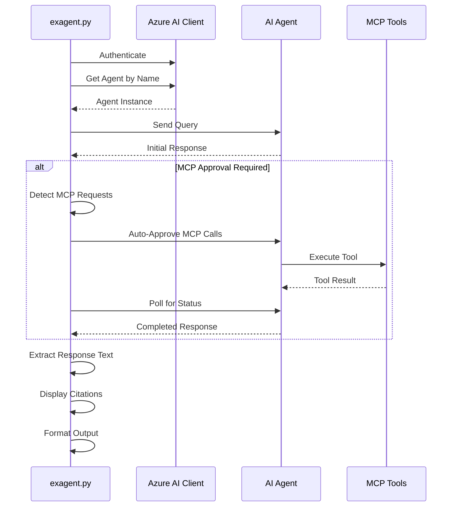

# exagent.py - Existing Agent Consumption Documentation

## 📋 Overview

`exagent.py` demonstrates how to interact with existing AI agents deployed in Azure AI Foundry. It shows how to retrieve agents, send queries, handle MCP (Model Context Protocol) approval requests, and process responses with citations.

## 🎯 Purpose

- **Retrieve** existing AI agents from Azure AI Foundry
- **Execute** queries against deployed agents
- **Handle** MCP approval requests automatically
- **Process** responses with citations and annotations
- **Display** formatted results with citations
- **Validate** agent functionality in production

## 🏗️ Architecture



## 📦 Dependencies

```python
from azure.identity import DefaultAzureCredential
from azure.ai.projects import AIProjectClient
from agent_framework.observability import get_tracer, setup_observability
from opentelemetry.trace import SpanKind
from opentelemetry.trace.span import format_trace_id
from dotenv import load_dotenv
import os
import re
import time
```

### Key Libraries

| Library | Purpose |
|---------|---------|
| `azure.ai.projects` | Azure AI Project client for agent interaction |
| `azure.identity` | Azure authentication |
| `agent_framework.observability` | OpenTelemetry tracing |
| `re` | Regular expressions for text extraction |
| `time` | Polling and delays |

## 🔧 Configuration

### Environment Variables

```bash
# Azure AI Project Endpoint (required)
AZURE_AI_PROJECT=https://your-project.api.azureml.ms

# Azure Authentication (for service principal)
AZURE_SUBSCRIPTION_ID=your-subscription-id
AZURE_TENANT_ID=your-tenant-id
AZURE_CLIENT_ID=your-client-id
```

## 📝 Code Walkthrough

### 1. Agent Retrieval

```python
myAgent = "cicdagenttest"
project_client = AIProjectClient(
    endpoint=myEndpoint,
    credential=DefaultAzureCredential(),
)

# Get an existing agent
agent = project_client.agents.get(agent_name=myAgent)
print(f"Retrieved agent: {agent.name}")
```

**What it does:**
- Creates AIProjectClient with authentication
- Retrieves agent by name from Azure AI Foundry
- Returns agent instance for interaction
- Validates agent exists

**Common Use Cases:**
- Application startup initialization
- Validating agent deployment
- Multi-agent orchestration
- Agent status checking

### 2. OpenAI Client Creation

```python
openai_client = project_client.get_openai_client()
```

**What it does:**
- Creates OpenAI-compatible client
- Enables agent response API access
- Handles authentication automatically
- Supports streaming and non-streaming responses

### 3. Text Extraction Helper

```python
def extract_response_text(raw):
    raw = str(raw)
    m = re.search(r"ResponseOutputText\(.*?text='([^']+)'", raw, re.DOTALL)
    return m.group(1) if m else None
```

**Purpose:**
- Extracts text from response objects
- Handles complex response structures
- Provides fallback for missing data
- Useful for legacy response formats

### 4. Sending Agent Query

```python
response = openai_client.responses.create(
    input=[{"role": "user", "content": "Summarize the RFP for virginia Railway Express project?"}],
    extra_body={"agent": {"name": agent.name, "type": "agent_reference"}},
)

print("Initial Response Status:", response.status)
print("Response ID:", response.id)
```

**Key Parameters:**
- `input`: List of messages (supports conversation history)
- `extra_body`: Agent reference for routing the request
- `agent.name`: Name of the agent to use
- `type`: "agent_reference" indicates using existing agent

**Response States:**
- `queued`: Request is waiting
- `in_progress`: Agent is processing
- `requires_action`: MCP approval needed
- `completed`: Response ready
- `failed`: Error occurred

### 5. MCP Approval Request Handling

```python
mcp_approval_requests = []
for output_item in response.output:
    if hasattr(output_item, 'type') and output_item.type == 'mcp_approval_request':
        mcp_approval_requests.append(output_item)
        print(f"MCP Approval Request Found:")
        print(f"  - ID: {output_item.id}")
        print(f"  - Tool: {output_item.name}")
        print(f"  - Server: {output_item.server_label}")
        print(f"  - Arguments: {output_item.arguments}")
```

**What is MCP (Model Context Protocol)?**
- Protocol for agents to access external tools and data
- Requires approval for security reasons
- Can access files, APIs, databases, etc.
- Provides audit trail for tool usage

**MCP Request Fields:**
- `id`: Unique identifier for approval request
- `name`: Tool name being requested
- `server_label`: MCP server providing the tool
- `arguments`: Parameters for the tool call

**Security Considerations:**
- Always validate tool requests
- Log all approvals for audit
- Consider implementing approval workflows
- Reject suspicious or unnecessary requests

### 6. Auto-Approval of MCP Requests

```python
if mcp_approval_requests:
    print(f"Auto-approving {len(mcp_approval_requests)} MCP tool call(s)...")
    
    for approval_request in mcp_approval_requests:
        response = openai_client.responses.create(
            previous_response_id=response.id,
            input=[{
                "type": "mcp_approval_response",
                "approve": True,
                "approval_request_id": approval_request.id
            }],
            extra_body={"agent": {"name": agent.name, "type": "agent_reference"}}
        )
        print(f"✓ Approved: {approval_request.name}")
```

**Auto-Approval Flow:**
1. Detect MCP approval requests
2. Create approval response
3. Reference previous response ID
4. Send approval for each request
5. Agent continues execution

**Manual Approval Alternative:**
```python
# For production, consider manual approval
approval_required = input(f"Approve {approval_request.name}? (y/n): ")
if approval_required.lower() == 'y':
    # ... approve
else:
    # Reject or skip
```

### 7. Polling for Completion

```python
max_retries = 30
retry_count = 0

while retry_count < max_retries:
    response = openai_client.responses.retrieve(response_id=response.id)
    
    if response.status == 'completed':
        print("Response completed!")
        break
    elif response.status == 'failed':
        print("Response failed!")
        if response.error:
            print(f"Error: {response.error}")
        break
    else:
        print(f"Status: {response.status} - waiting...")
        time.sleep(2)
        retry_count += 1
```

**Polling Strategy:**
- Poll every 2 seconds
- Maximum 30 retries (60 seconds total)
- Check for completion or failure
- Handle timeouts gracefully

**Best Practices:**
- Use exponential backoff for production
- Set appropriate timeout based on expected duration
- Log polling attempts for debugging
- Handle network errors

### 8. Response Processing

```python
for output_item in response.output:
    item_type = getattr(output_item, 'type', None)
    
    # Check for message output (ResponseOutputMessage)
    if item_type == 'message':
        print("\n📄 Response Text:")
        if hasattr(output_item, 'content') and output_item.content:
            for content_item in output_item.content:
                if hasattr(content_item, 'text'):
                    print(content_item.text)
                    
                    # Display citations
                    if hasattr(content_item, 'annotations') and content_item.annotations:
                        print("\n📚 Citations:")
                        for i, annotation in enumerate(content_item.annotations, 1):
                            print(f"\n  [{i}] {annotation.text}")
                            if hasattr(annotation, 'file_citation'):
                                citation = annotation.file_citation
                                print(f"      Source: {citation.file_name}")
                                if hasattr(citation, 'quote'):
                                    print(f"      Quote: {citation.quote}")
```

**Response Types:**
- `message`: Main response content
- `response_output_text`: Legacy text output
- `mcp_call`: Tool execution results

**Citation Handling:**
- Annotations contain source references
- File citations link to documents
- Quotes provide exact text matches
- Useful for RAG (Retrieval Augmented Generation)

### 9. MCP Call Results Display

```python
elif item_type == 'mcp_call':
    print("\n🔧 MCP Tool Call:")
    print(f"  Tool: {output_item.name}")
    print(f"  Status: {output_item.status}")
    if hasattr(output_item, 'output') and output_item.output:
        output_text = str(output_item.output)
        if len(output_text) > 500:
            print(f"  Output: {output_text[:500]}... (truncated)")
        else:
            print(f"  Output: {output_text}")
```

**What it shows:**
- Which tool was executed
- Tool execution status
- Tool output (truncated if too long)
- Useful for debugging MCP interactions

## 🚀 Usage Examples

### Basic Usage (Local Development)

```bash
# Install dependencies
pip install -r requirements.txt

# Set environment variables
export AZURE_AI_PROJECT="https://your-project.api.azureml.ms"

# Run the script
python exagent.py
```

### Expected Output

```
Trace ID: 1234567890abcdef1234567890abcdef
Retrieved agent: cicdagenttest
Initial Response Status: in_progress
Response ID: resp_abc123

================================================================================

MCP Approval Request Found:
  - ID: req_xyz789
  - Tool: search_files
  - Server: filesystem
  - Arguments: {'path': '/docs', 'pattern': '*.md'}

Auto-approving 1 MCP tool call(s)...

✓ Approved: search_files

================================================================================

Waiting for final response...
Status: in_progress - waiting...
Status: in_progress - waiting...
Response completed!

================================================================================

FINAL RESPONSE:
================================================================================

📄 Response Text:
Here's a summary of the Virginia Railway Express RFP based on the documentation:

[Agent response content here]

📚 Citations:

  [1] Virginia Railway Express RFP
      Source: vrx-rfp-2024.pdf
      Quote: "The project aims to modernize the rail infrastructure..."

================================================================================

End of conversation with agent.
```

### CI/CD Usage (Azure DevOps)

```yaml
- task: AzureCLI@2
  displayName: 'Test Existing Agent in Dev'
  inputs:
    azureSubscription: '$(AZURE_SERVICE_CONNECTION_DEV)'
    scriptType: 'bash'
    scriptLocation: 'inlineScript'
    inlineScript: |
      export AZURE_AI_PROJECT="$(AZURE_AI_PROJECT_DEV)"
      python exagent.py
```

### CI/CD Usage (GitHub Actions)

```yaml
- name: Test Existing Agent
  run: |
    export AZURE_AI_PROJECT="${{ secrets.AZURE_AI_PROJECT_DEV }}"
    python exagent.py
```

## 🔍 Troubleshooting

### Common Issues and Solutions

#### 1. Agent Not Found

**Error:** `Agent 'cicdagenttest' not found`

**Solutions:**
```bash
# Verify agent exists in Azure AI Foundry portal
# Or create the agent first
python createagent.py

# Check agent name spelling
myAgent = "cicdagenttest"  # Ensure exact match
```

#### 2. MCP Approval Timeout

**Error:** Response stuck in `requires_action` state

**Solution:**
```python
# Increase polling retries
max_retries = 60  # Up to 2 minutes

# Or check MCP approval logic
# Ensure auto-approval is working
```

#### 3. Empty or No Response

**Error:** Response has no content

**Solutions:**
```python
# Check response status
print(f"Response status: {response.status}")
print(f"Response output: {response.output}")

# Verify query is appropriate for agent
# Ensure agent has necessary tools/knowledge
```

#### 4. Citation Errors

**Error:** `'NoneType' object has no attribute 'annotations'`

**Solution:**
```python
# Add defensive checks
if hasattr(content_item, 'annotations') and content_item.annotations:
    # Process citations
    pass
```

## 🎨 Customization

### Custom Query

```python
# Change the query to match your use case
custom_query = "What are the best practices for CI/CD in Python?"

response = openai_client.responses.create(
    input=[{"role": "user", "content": custom_query}],
    extra_body={"agent": {"name": agent.name, "type": "agent_reference"}},
)
```

### Conversation History

```python
# Multi-turn conversation
conversation = [
    {"role": "user", "content": "What is CI/CD?"},
    {"role": "assistant", "content": "CI/CD stands for..."},
    {"role": "user", "content": "How do I implement it?"}
]

response = openai_client.responses.create(
    input=conversation,
    extra_body={"agent": {"name": agent.name, "type": "agent_reference"}},
)
```

### Conditional MCP Approval

```python
# Approve only specific tools
approved_tools = ['search_files', 'read_file']

for approval_request in mcp_approval_requests:
    if approval_request.name in approved_tools:
        # Approve
        response = openai_client.responses.create(
            previous_response_id=response.id,
            input=[{
                "type": "mcp_approval_response",
                "approve": True,
                "approval_request_id": approval_request.id
            }],
            extra_body={"agent": {"name": agent.name, "type": "agent_reference"}}
        )
    else:
        print(f"✗ Rejected: {approval_request.name}")
```

### Enhanced Error Handling

```python
def existingagent():
    try:
        setup_observability()
        project_client = AIProjectClient(
            endpoint=myEndpoint,
            credential=DefaultAzureCredential(),
        )
        
        # ... rest of code ...
        
    except Exception as e:
        print(f"Error: {e}")
        import traceback
        traceback.print_exc()
        raise
```

## 📊 Monitoring and Observability

### Trace Context

```python
with get_tracer().start_as_current_span("ExistingCICDAgent", kind=SpanKind.CLIENT) as current_span:
    print(f"Trace ID: {format_trace_id(current_span.get_span_context().trace_id)}")
    
    # Add custom attributes
    current_span.set_attribute("agent.name", myAgent)
    current_span.set_attribute("query", "Your query here")
    
    # Your code here
```

### Custom Metrics

```python
from agent_framework.observability import get_meter

meter = get_meter()
response_counter = meter.create_counter(
    "agent.responses",
    description="Number of agent responses"
)

# Increment on each response
response_counter.add(1, {"agent": myAgent, "status": response.status})
```

## 🔐 Security Considerations

### MCP Approval Security

✅ **DO:**
- Validate tool names and arguments
- Log all approvals for audit
- Implement approval workflows for production
- Reject unknown or suspicious tools
- Monitor MCP usage patterns

❌ **DON'T:**
- Auto-approve all requests blindly
- Ignore tool arguments
- Skip logging approvals
- Allow unrestricted tool access

### Query Validation

```python
# Sanitize user input
def sanitize_query(query):
    # Remove potentially harmful content
    # Limit query length
    # Validate query format
    return query[:1000]  # Example: limit length

sanitized_query = sanitize_query(user_input)
response = openai_client.responses.create(
    input=[{"role": "user", "content": sanitized_query}],
    # ...
)
```

## 📈 Best Practices

### 1. Retry Logic with Exponential Backoff

```python
import time

def poll_with_backoff(response_id, max_retries=10):
    delay = 1
    for attempt in range(max_retries):
        response = openai_client.responses.retrieve(response_id=response_id)
        
        if response.status in ['completed', 'failed']:
            return response
        
        time.sleep(delay)
        delay = min(delay * 2, 30)  # Max 30 seconds
    
    raise TimeoutError("Response did not complete in time")
```

### 2. Response Caching

```python
import functools
from datetime import datetime, timedelta

@functools.lru_cache(maxsize=100)
def cached_agent_query(agent_name, query, cache_key):
    # Query agent and return result
    # cache_key can be timestamp rounded to hour/day
    pass

# Use with cache key
cache_key = datetime.now().replace(minute=0, second=0, microsecond=0)
result = cached_agent_query(myAgent, "your query", cache_key)
```

### 3. Structured Logging

```python
import logging
import json

logger = logging.getLogger(__name__)

logger.info(json.dumps({
    "event": "agent_query",
    "agent": myAgent,
    "query": query,
    "response_id": response.id,
    "status": response.status,
    "timestamp": datetime.now().isoformat()
}))
```

## 🔗 Related Documentation

- [createagent.py](./createagent.md) - Creating new agents
- [agenteval.py](./agenteval.md) - Evaluating agents
- [redteam.py](./redteam.md) - Security testing
- [Deployment Guide](./deployment.md) - CI/CD deployment
- [Architecture](./architecture.md) - System architecture

## 📚 Additional Resources

- [Azure AI Projects SDK](https://learn.microsoft.com/python/api/overview/azure/ai-projects-readme)
- [Model Context Protocol (MCP)](https://spec.modelcontextprotocol.io/)
- [OpenAI API Reference](https://platform.openai.com/docs/api-reference)
- [Retrieval Augmented Generation (RAG)](https://learn.microsoft.com/azure/ai-services/openai/concepts/retrieval-augmented-generation)

---

**Last Updated**: December 2025  
**Version**: 1.0  
**Maintained by**: DevOps & AI Teams
